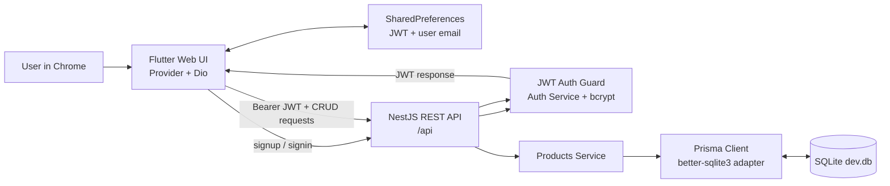

# Product Manager

A simple full-stack product inventory application.

- **Frontend:** Flutter with Provider, Dio, and SharedPreferences
- **Backend:** NestJS with TypeScript, JWT authentication, bcrypt, and REST APIs
- **Database:** SQLite managed with Prisma and the `better-sqlite3` adapter
- **Target development platform:** Flutter Web in Chrome

## Prerequisites

Install the following tools:

- Node.js and npm
- Flutter SDK
- Chrome
- Git (optional)

Verify the installations:

```powershell
node --version
npm --version
flutter --version
```

## Project Structure

```text
backend/     NestJS REST API, Prisma schema, migrations, and SQLite database
frontend/    Flutter application
README.md    Project setup and implementation notes
```

## Basic Setup

Open two terminals from `D:\product_manager`.

### 1. Configure the backend

The backend uses the existing `backend/.env` file:

```env
DATABASE_URL="file:./dev.db"
JWT_SECRET="product-manager-secret-key"
PORT=3000
```

For a real deployment, replace the development JWT secret with a private environment variable.

Install dependencies and prepare Prisma:

```powershell
cd backend
npm install
npx prisma generate
npx prisma migrate deploy
```

`migrate deploy` applies the checked-in migrations to the configured SQLite database. It does not delete the database, users, or products.

### 2. Start the backend

From `D:\product_manager\backend`:

```powershell
npm run start:dev
```

The API runs at:

```text
http://localhost:3000/api
```

A successful startup prints the registered authentication and product routes.

### 3. Start the Flutter frontend

In a second terminal:

```powershell
cd frontend
flutter pub get
flutter run -d chrome
```

Flutter Web uses `http://localhost:3000/api` for the backend. Keep the NestJS server running while using the application.

## Useful Commands

### Backend

```powershell
cd backend
npm run build       # Compile NestJS
npm run lint        # Check TypeScript source
npm run test        # Run unit tests
npm run test:e2e    # Run end-to-end tests
```

### Frontend

```powershell
cd frontend
flutter analyze     # Analyze Dart code
flutter build web   # Build the web application
flutter run -d chrome
```

## API Design

All product routes require a JWT in the `Authorization` header:

```text
Authorization: Bearer <accessToken>
```

### Authentication

| Method | Route | Purpose |
| --- | --- | --- |
| `POST` | `/api/auth/signup` | Create a user and return a JWT |
| `POST` | `/api/auth/signin` | Authenticate a user and return a JWT |

Signup and signin responses contain an `accessToken` and safe user fields. Passwords are hashed with bcrypt and never returned.

### Products

| Method | Route | Purpose |
| --- | --- | --- |
| `POST` | `/api/products` | Create a product |
| `GET` | `/api/products` | List the authenticated user's products |
| `GET` | `/api/products/:id` | Read one product |
| `PATCH` | `/api/products/:id` | Update one product |
| `DELETE` | `/api/products/:id` | Delete one product |

Product operations are always scoped to the authenticated user's `userId`.

## Database Schema

Prisma uses SQLite for a small, local inventory application with minimal infrastructure.

- `User` stores a unique email, bcrypt password hash, and timestamps.
- `Product` stores name, category, quantity, price, owner, and timestamps.
- One user can own many products.
- Deleting a user cascades to that user's products.
- An index on `Product.userId` supports user-scoped product queries.

The schema is in `backend/prisma/schema.prisma`; migrations are in `backend/prisma/migrations`.

## Implementation Plan

1. **Authentication:** Flutter submits credentials through Dio. NestJS validates the DTO, checks the user, hashes passwords for signup, and signs a JWT.
2. **Session state:** Flutter stores the JWT and display email in SharedPreferences. Provider state controls loading and authentication status.
3. **Authorization:** The NestJS JWT guard reads the token and attaches the user identity to each protected product request.
4. **CRUD workflow:** Product service methods use Prisma and always include the authenticated `userId` when reading, updating, or deleting records.
5. **User interface:** Flutter screens provide sign in, signup, inventory list, product form, product details, edit, delete confirmation, and logout while keeping API logic in `ApiService`.
6. **Validation:** Backend DTO validation enforces email, password length, non-negative quantity, and non-negative price. Flutter provides immediate form feedback.

## Working Diagram



## Typical Workflow

1. Start the backend on port `3000`.
2. Start Flutter Web in Chrome.
3. Create an account or sign in.
4. Create a product from the inventory list.
5. Open the product to read details, edit it, or delete it.
6. Sign out and sign in again to confirm the JWT-backed session works.

## Troubleshooting

- **Unable to connect:** Confirm the backend is running on port `3000` and Flutter is using `http://localhost:3000/api`.
- **CORS error in Chrome:** Confirm `app.enableCors()` is enabled in `backend/src/main.ts`.
- **Database startup error:** Confirm `backend/.env` exists and `DATABASE_URL="file:./dev.db"` is set.
- **Stale Flutter session:** Sign out from the app, or clear the browser's local storage for the Flutter development origin.
